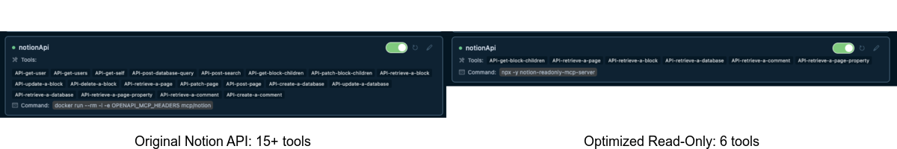

# Notion ReadOnly MCP Server

This project implements an optimized read-only MCP server for the Notion API, focusing on performance and efficiency for AI assistants to query and retrieve Notion content.

## Key Improvements

- **Read-Only Design**: Focused exclusively on data retrieval operations, ensuring safe access to Notion content.
- **Minimized Tool Set**: Reduced the number of exposed Notion API tools from 15+ to only 6 essential ones for document analysis.
- **Parallel Processing**: Enhanced performance by implementing asynchronous and parallel API requests for retrieving block content, significantly reducing response times.
- **Extended Database Access**: Added support for database, page property, and comment retrieval operations.
- **Optimized for AI Assistants**: Significantly reduced tool count addresses the "Too many tools can degrade performance" issue in AI assistants like Cursor, which limits models to approximately 40 tools.

## Tool Comparison

This read-only implementation exposes far fewer tools compared to the standard Notion API integration, improving performance and compatibility with AI assistants:



The reduced tool set helps stay within the recommended tool limits for optimal AI assistant performance while still providing all essential functionality.

## Installation

### 1. Setting up Integration in Notion:

Go to https://www.notion.so/profile/integrations and create a new **internal** integration or select an existing one.


While we limit the scope of Notion API's exposed to read-only operations, there is a non-zero risk to workspace data by exposing it to LLMs. Security-conscious users may want to further configure the Integration's _Capabilities_.

For example, you can create a read-only integration token by giving only "Read content" access from the "Configuration" tab:


### 2. Adding MCP config to your client:

#### Using npm:

Add the following to your `.cursor/mcp.json` or `claude_desktop_config.json` (MacOS: `~/Library/Application\ Support/Claude/claude_desktop_config.json`)

```json
{
  "mcpServers": {
    "notionApi": {
      "command": "npx",
      "args": ["-y", "notion-readonly-mcp-server"],
      "env": {
        "OPENAPI_MCP_HEADERS": "{\"Authorization\": \"Bearer ntn_****\", \"Notion-Version\": \"2022-06-28\" }"
      }
    }
  }
}
```

#### Using Docker:

Add the following to your `.cursor/mcp.json` or `claude_desktop_config.json`:

```json
{
  "mcpServers": {
    "notionApi": {
      "command": "docker",
      "args": [
        "run",
        "--rm",
        "-i",
        "-e", "OPENAPI_MCP_HEADERS",
        "taewoong1378/notion-readonly-mcp-server"
      ],
      "env": {
        "OPENAPI_MCP_HEADERS": "{\"Authorization\":\"Bearer ntn_****\",\"Notion-Version\":\"2022-06-28\"}"
      }
    }
  }
}
```

Don't forget to replace `ntn_****` with your integration secret. Find it from your integration configuration tab.

### 3. Connecting content to integration:

Ensure relevant pages and databases are connected to your integration.

To do this, visit the page, click on the 3 dots, and select "Connect to integration".


## Available Tools

This optimized server exposes only essential read-only Notion API tools:

- `API-retrieve-a-page`: Get page information
- `API-get-block-children`: Get page content blocks (with parallel processing)
- `API-retrieve-a-block`: Get details about a specific block
- `API-retrieve-a-database`: Get database information
- `API-retrieve-a-comment`: Get comments on a page or block
- `API-retrieve-a-page-property`: Get specific property information from a page

By limiting to these 6 essential tools (compared to 15+ in the standard implementation), we ensure:

1. Better performance in AI assistants like Cursor and Claude that have tool count limitations
2. Reduced cognitive load for AI models when choosing appropriate tools
3. Faster response times with fewer API options to consider
4. Enhanced security through minimized API surface area

## Asynchronous Processing

The server implements advanced parallel processing techniques for handling large Notion documents:

- Multiple requests are batched and processed concurrently
- Pagination is handled automatically for block children
- Results are efficiently aggregated before being returned
- Console logging provides visibility into the process without affecting response format

## Examples

1. Using the following instruction:

```
Get the content of page 1a6b35e6e67f802fa7e1d27686f017f2
```

The AI will retrieve the page details efficiently with parallel processing of block content.

2. Using database information:

```
Get the structure of database 8a6b35e6e67f802fa7e1d27686f017f2
```

## Development

Build:

```
pnpm build
```

Execute:

```
pnpm dev
```

## License

MIT

## AI Assistant Performance Benefits

Modern AI assistants like Cursor and Claude have limitations on the number of tools they can effectively handle:

- Most models may not respect more than 40 tools in total
- Too many tools can degrade overall performance and reasoning capabilities
- Complex tool sets increase response latency and decision-making difficulty

This read-only implementation deliberately reduces the Notion API surface to address these limitations while preserving all essential functionality. The result is:

- Faster and more reliable responses from AI assistants
- Improved accuracy when interacting with Notion content
- Better overall performance through focused API design
